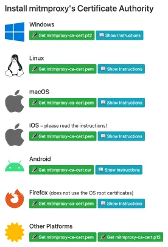
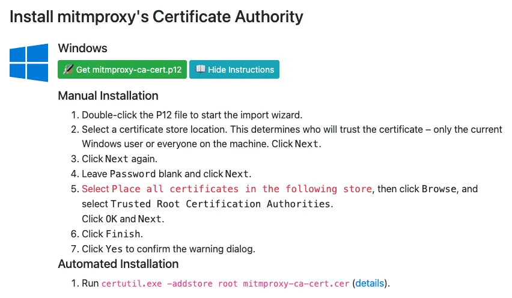

# mitmproxy連携によるHTTPSサポート

2025年10月中旬のアップデートで艦これAPIの通信方式がHTTPSになり、これまでの内蔵プロキシサーバー実装が使えなくなりました。

対策として[パッシブモードとx-ray-proxyの組み合わせ](./how-to-passive-mode.md)を用意していたのですが、これはあまりにも導入が難しく、またlogbook-kaiを使うだけなら不要な機能満載であったため、logbook-kaiから[mitmproxy](https://www.mitmproxy.org/)を起動し、そちらに通信のキャプチャを任せられるようにしました。

以下はその利用方法です。

## 1. mitmproxyのインストール

https://www.mitmproxy.org/ からmitmproxyをダウンロード、インストールしてください。

## 2. logbook-kaiの設定

「設定」＞「通信」タブで「mitmproxyを使用する」にチェックを入れ、「mitmdump実行ファイル」で手順1でインストールしたmitmproxyプログラムのうち、`mitmdump` を選択します。[^1][^2]

設定が完了したらlogbook-kaiを一度終了させ、再起動してください。

## 3. プロキシ自動構成スクリプトの再設定

[航海日誌 Proxy設定](./how-to-preference.md)に従って、プロキシの設定をし直してください。

次の手順で `mitm.it` へのアクセスもlogbook-kai（が起動しているmitmproxy）を通すために必要です。

## 4. ルートCA証明書のインストール

HTTPS通信を扱えるようにするためにmitmproxyが発行するルート認証局(CA)のSSL/TLS証明書をインストールする必要があります。

Webブラウザで `http://mitm.it` を開いてください。手順3の設定が正しくできていれば、以下のようなWebサイトが表示されます。ここからそれぞれのOSに応じた形式の証明書を「Get mitmproxy-ca-cert.\*」をクリックしてダウンロードし、「Show Instructions」をクリックして表示される説明に従って証明書をインストールしてください。

以下はWindowsでマニュアルインストールする方法の和訳です。

1. ダウンロードした `mitmproxy-ca-cert.p12` ファイルをダブルクリックしてインポートウィザードを起動します。
2. 証明書ストアの場所を選択します。ここで、現在のWindowsユーザーのみが証明書を信頼するのか、それともマシン上のすべてのユーザーが信頼するのかが決まります。「次へ」をクリックします。
3. もう一度「次へ」をクリックします。
4. パスワードは空白のままにして「次へ」をクリックします。
5. 「証明書をすべて次のストアに配置する」を選択し、「参照」をクリックして、「信頼されたルート証明機関」を選択します。「OK」と「次へ」をクリックします。
6. 「完了」をクリックします。
7. 警告ダイアログで「はい」をクリックして確認します。

## 5. 動作確認

これで設定は完了、艦これを開いてlogbook-kaiの情報が更新されたら成功です。

[^1]: 「通信」タブの「ポート番号」に `8765` を指定している場合は、別のポートに変更してください。8765番はmitmproxy-javaが内部的な通信のために使っている固定のポート番号で、競合が発生します。

[^2]: 「接続にプロキシを利用する(他ツール連携)」機能は廃止され、「通信」タブからこれに関わる設定項目は削除されました。
