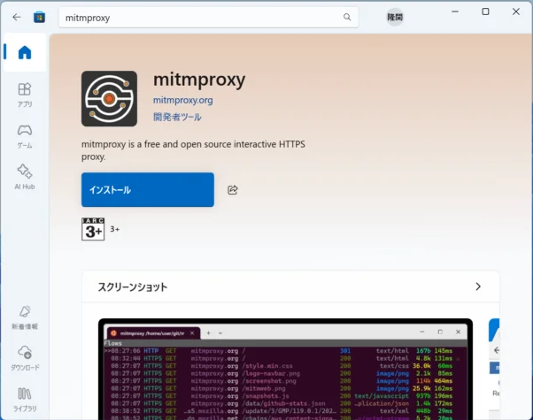
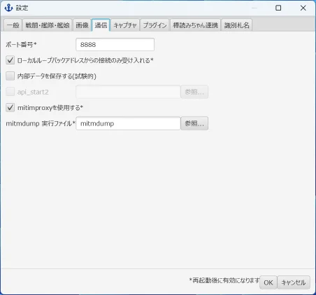
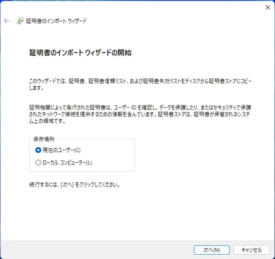
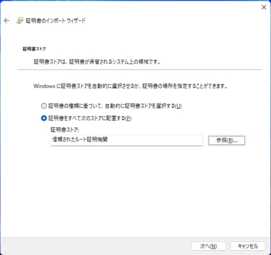

# mitmproxy連携によるHTTPSサポート

2025年10月中旬のアップデートで艦これAPIの通信方式がHTTPSになり、これまでの内蔵プロキシサーバー実装が使えなくなりました。

対策として[パッシブモードとx-ray-proxyの組み合わせ](./how-to-passive-mode.md)を用意していたのですが、これはあまりにも導入が難しく、また航海日誌を使うだけなら不要な機能満載であったため、航海日誌から[mitmproxy (mitmdump)](https://www.mitmproxy.org/)を起動し、そちらに通信のキャプチャを任せられるようにしました。

以下はその利用方法です。

## 1. mitmproxyのインストール

https://www.mitmproxy.org/ の案内に従ってmitmproxyをダウンロード、インストールしてください。

WindowsではMicrosoft Storeからインストールしたもので動作確認しています。

## 2. 航海日誌の設定

1. 「設定」＞「通信」タブを開きます。
2. 「mitmproxyを使用する」にチェックを入れます。
3. 「mitmdump実行ファイル」で手順1でインストールしたmitmproxyプログラムのうち、`mitmdump` を選択します。
   - Microsoft Storeからインストールした場合など、`mitmdump` にパスが通っている場合はデフォルトの `mitmdump` のままでOKです。
4. 設定が完了したら航海日誌を一度終了させ、再起動してください。

**手順2-2: mitmproxyを使用する** [^1] 

## 3. プロキシ自動構成スクリプトの再設定

[航海日誌 Proxy設定](./how-to-preference.md)に従って、プロキシの設定をし直してください。

次の手順で `mitm.it` へのアクセスも航海日誌（が起動しているmitmproxy）を通すために必要です。

## 4. ルートCA証明書のインストール

HTTPS通信を扱えるようにするためにmitmproxyが発行するルート認証局(CA)のSSL/TLS証明書をインストールする必要があります。

Webブラウザで `http://mitm.it` を開いてください。手順3の設定が正しくできていれば、以下のようなWebサイトが表示されます。ここからそれぞれのOSに応じた形式の証明書を「Get mitmproxy-ca-cert.\*」をクリックしてダウンロードし、「Show Instructions」をクリックして表示される説明に従って証明書をインストールしてください。

以下はWindowsでマニュアルインストールする方法の和訳です。

1. ダウンロードした `mitmproxy-ca-cert.p12` ファイルをダブルクリックしてインポートウィザードを起動します。
2. 証明書ストアの場所を選択します。ここで、現在のWindowsユーザーのみが証明書を信頼するのか、それともマシン上のすべてのユーザーが信頼するのかが決まります。「次へ」をクリックします。
   - （訳注：セキュリティに関わる項目です。特に理由が無い限りは影響範囲の小さい「現在のユーザー」にしてください。）
3. もう一度「次へ」をクリックします。
4. パスワードは空白のままにして「次へ」をクリックします。
5. 「証明書をすべて次のストアに配置する」を選択し、「参照」をクリックして、「信頼されたルート証明機関」を選択します。「OK」と「次へ」をクリックします。
6. 「完了」をクリックします。
7. 警告ダイアログで「はい」をクリックして確認します。

**手順4-2: 証明書ストアの場所を選択** 

**手順4-5: 信頼されたルート証明機関を選択** 

## 5. 動作確認

これで設定は完了、艦これを開いて航海日誌に表示される情報が更新されたら成功です。

## トラブルシューティング

### Q. 起動時に「ポートが使用中です」と表示されデータが更新されません

A. 他に航海日誌が使うポートを使用しているソフトウェアに心当たりがないなら、航海日誌が以前に起動していたmitmdumpの終了に失敗しているかもしれません。

#### 対応手順

1. Windowsならタスクマネージャーを開いてmitmdumpで検索、タスクが存在していたら終了させます。
2. ポートの競合が発生しているソフトウェアを終了したら、航海日誌を再起動してください。

[^1]: 「接続にプロキシを利用する(他ツール連携)」機能は廃止され、「通信」タブからこれに関わる設定項目は削除されました。
