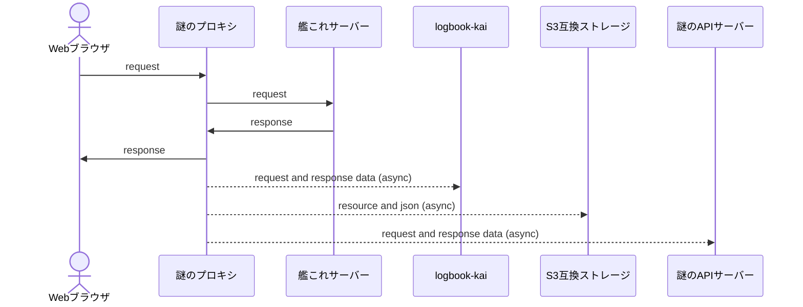

## logbook-kai passive mode

### モチベーションとコンセプト

- 独自のプロキシを開発中だが、Web GUIがまだまだなのでプロキシは独自のものを使いつつ、当面の間GUIは航海日誌を使いたい。
- HTTPS対応を見据えて、多段プロキシではなく、HTTP POSTでデータを受け取る。(TLS通信は独自プロキシのみでハンドリングする)

### 概念図

開発中の謎のプロキシと、それと連携する謎のAPIサーバー、S3互換ストレージ、航海日誌の関係を示す。

### 実装

[PassiveModeServlet.java](./src/main/java/logbook/internal/proxy/PassiveModeServlet.java)

### API仕様

#### エンドポイント

`http://<航海日誌のホスト>:<航海日誌のポート>/pasv` + オリジナルのリクエストURL。

- 例1： `http://203.104.209.87/kcsapi/api_port/port` → `http://localhost:8888/pasv/kcsapi/api_port/port`
- 例2： `http://203.104.209.87/kcs2/resources/ship/full/0001_5865_snohitatusbk.png?version=46` → `http://localhost:8888/pasv/kcs2/resources/ship/full/0001_5865_snohitatusbk.png?version=46`

#### リクエストヘッダ

これら航海日誌で必要な最低限の情報をHTTPヘッダに含める。

| ヘッダ名                      | 必須？     | 説明                                                                                             |
| ----------------------------- | ---------- | ------------------------------------------------------------------------------------------------ |
| `X-Pasv-Request-Method` [^1]  | 必須       | リクエストのHTTPメソッド。`GET` or `POST`                                                        |
| `X-Pasv-Request-Content-Type` | もしあれば | POSTリクエストの場合、Content-Typeヘッダの値。例：`application/x-www-form-urlencoded`            |
| `X-Pasv-Request-Body`         | もしあれば | POSTリクエストの場合、リクエストボディをBase64エンコードしたもの。巨大なデータは想定していない。 |
| `Content-Type`                | もしあれば | レスポンスのContent-Typeヘッダの値。例：`text/plain`, `image/png`                                |
| `Content-Encoding`            | もしあれば | レスポンスのContent-Encodingヘッダの値。例：`gzip`                                               |

[^1]: 独自HTTPヘッダは `X-` で始まっており、これはRFCで非推奨になっているが、標準化の予定などあるはずもない完全プライベートな仕様なので気にしない。

#### リクエストボディ

レスポンスボディそのまま。gzipデコードもされていない生のもの。
