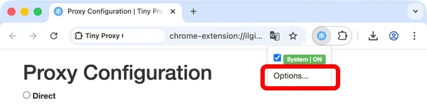
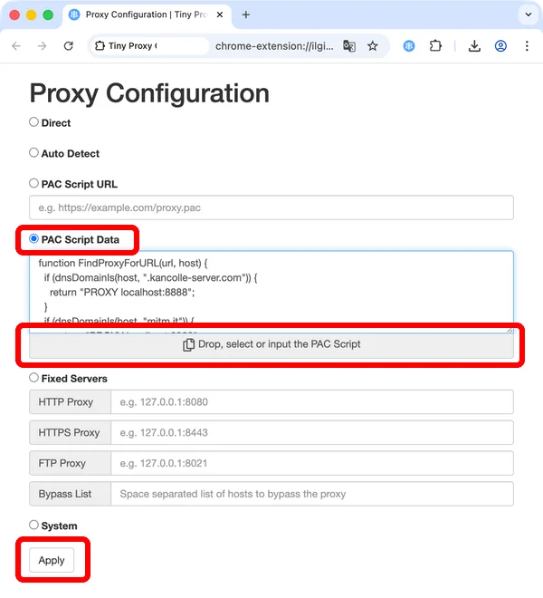
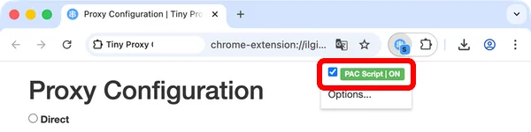
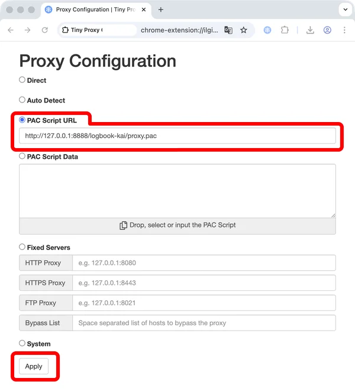

# 航海日誌 Proxy設定

航海日誌を使用しながら艦これで遊ぶには、プロキシの設定が必要となります。

お使いのブラウザによって設定方法が異なりますのでご注意ください。

ここでは以下のブラウザにおける設定方法について説明します。

- Mozilla Firefoxの場合
- Google Chromeの場合

なおプロキシの設定を行った場合、航海日誌を起動しないと艦これが起動しなくなりますので注意してください。
(航海日誌を使用しない場合設定を戻して頂く必要があります(逆の手順で戻します))

## Firefox の場合

### Firefox の場合 1/3

航海日誌を起動後、[その他]-[自動プロキシ構成スクリプト]を選択します。

※航海日誌が[ポートが使用中です]というエラーメッセージを出した場合、ポートを8888から任意の別のポートに変更して下さい。

### Firefox の場合 2/3

[保存...]を選択してスクリプトファイルを保存後、

Firefox用のアドレスをコピーします。

### Firefox の場合 3/3

[オプション](about:preferences)を開き[詳細]-[ネットワーク]-[接続設定]を選択します。
[自動プロキシ設定スクリプトURL]にアドレスを貼り付けます。

設定は以上です。

## Chrome の場合

Google Chrome単体ではプロキシの設定が出来ないため拡張機能のインストールが必要です。[^1]

ここではrsky作の[Tiny Proxy Configurator](https://chromewebstore.google.com/detail/tiny-proxy-configurator/ilgignoiaacgbcagkcmfmbgnjbemedam)を例にして説明します。

プロキシ設定をする拡張機能は、他にも[プロキシーPACスイッチャー](https://chromewebstore.google.com/detail/%E3%83%97%E3%83%AD%E3%82%AD%E3%82%B7%E3%83%BCpac%E3%82%B9%E3%82%A4%E3%83%83%E3%83%81%E3%83%A3%E3%83%BC/dcokccgklilfbehagkdnmlpcdonfopeh)等、色々あります。
[Proxy SwitchyOmega 3 (ZeroOmega)](https://chromewebstore.google.com/detail/proxy-switchyomega-3-zero/pfnededegaaopdmhkdmcofjmoldfiped)ではPACをそのまま貼り付けただけではうまく動かないようです。

### Chrome の場合 1/4

航海日誌を起動後、[その他]-[自動プロキシ構成スクリプト]を選択します。

※航海日誌が[ポートが使用中です]というエラーメッセージを出した場合、ポートを8888から任意の別のポートに変更して下さい。

### Chrome の場合 2/4

[保存...]を選択してスクリプトファイルを保存します。(Firefox用のアドレスは使用しません)

### Chrome の場合 3/4

Tiny Proxy Configuratorのメニューから「Options...」を選択します。

### Chrome の場合 4/4

1. 「PAC Script Data」を選択します。
2. 「Drop, select or input the PAC Script」をクリックして手順2で作成したスクリプトファイルを選択するか、テキストボックスにドラッグ＆ドロップします。
3. テキストボックスにスクリプトの内容が表示されたら、「Apply」ボタンをクリックします。
4. 設定完了したら拡張アイコンが`[S]`マーク付きに変化し、メニューの表示が「PAC Script | ON」になっています。

## v25.10.2 以降の場合

`http://127.0.0.1:8888/logbook-kai/proxy.pac` でプロキシ自動構成スクリプトを配信できるようになったので、システムのプロキシ設定やFirefoxの「自動プロキシ設定スクリプトURL」、Tiny Proxy Configuratorの「PAC Script URL」等にそのURLを指定することでも設定可能です。 （ポート`8888`は適宜設定したポート番号に読み替えてください）[^2]

[^1] 以前ここで紹介していた[Proxy SwitchySharp](https://chrome.google.com/webstore/detail/proxy-switchysharp/dpplabbmogkhghncfbfdeeokoefdjegm)はChrome拡張のManifest v3に対応せず利用できなくなりました。

[^2] 航海日誌を起動後、Webブラウザで `http://127.0.0.1:8888/logbook-kai/proxy.pac` にアクセスしてproxy.pacがダウンロードされることで、確認できます。
