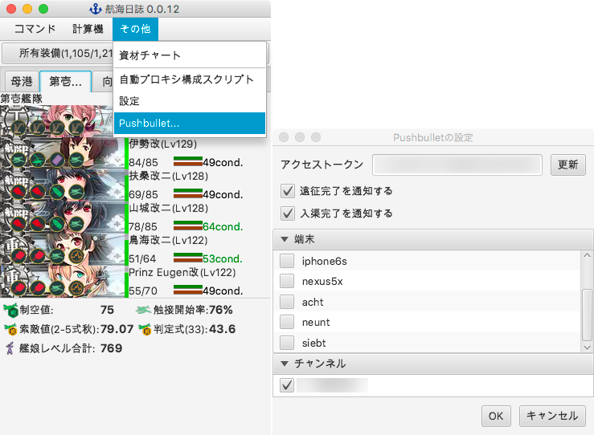

Pushbullet対応について
----------------------

### 何?

航海日誌に[Pushbullet](https://www.pushbullet.com/)を使って遠征・入渠の完了をプッシュ通知する機能を追加します。  
現在はforkして本体に直接機能を組み込むかたちとなっていますが、将来的にはプラグイン化したいと考えています。

### 設定方法

1. 「その他」メニュー内の「Pusubullet…」よりPushbulletの設定ウインドウを開きます。
2. Pushbulletの管理画面で取得したアクセストークンを入力し、「更新」ボタンを押します。
3. 登録させている端末およびチャンネルのリストが表示されるので、プッシュ通知したい対象をチェックして「OK」を押せば設定完了です。

### 使用ライブラリとライセンス

以下のライブラリを使用しています。

#### [Retrofit](http://square.github.io/retrofit/)

* Apache License 2.0
* **ライセンス全文 :** [http://square.github.io/retrofit/#license](http://square.github.io/retrofit/#license)

#### [RxJavaFX](https://github.com/ReactiveX/RxJavaFX)

* Apache License 2.0
* **ライセンス全文 :** [https://github.com/ReactiveX/RxJavaFX/blob/0.x/LICENSE](https://github.com/ReactiveX/RxJavaFX/blob/0.x/LICENSE)
